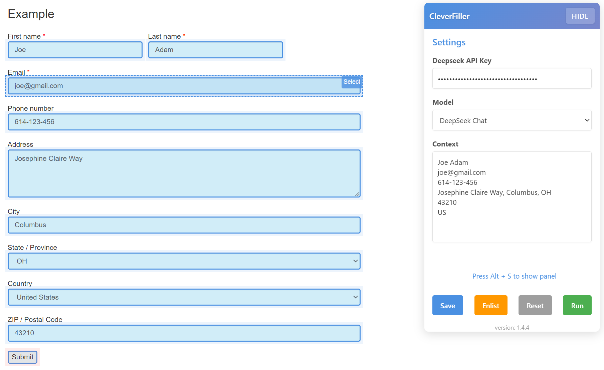

## Overview

A tampermonkey script that fills form fields, using AI model to find the best match data for the fields. Simply, it just frees you a lot of time from filling out boring forms.

Now it only supports Deepseek, but there are plans to support more AI models in the future. Support for Chinese and workflow mode will most likely be added soon.

## Usage

> [!NOTE]
> You need a [Deepseek API](https://deepseek.ai/) key to enable implementation of AI model.

1. Click the **Enlist** button to scan the fillable fields in the form.
2. Click on fields you would like to fill.
3. Input text containing everything you need to fill for the form and leave it to the AI model to find the best match data for the fields.
4. Click the **Run** button to fill the form fields.
5. There you go!

## Installation

1. Install [Scriptcat Extension](https://docs.scriptcat.org/) for your browser.
2. Import CleverFiller script to the extension with this [link](https://raw.githubusercontent.com/joolowweng/cleverfiller/main/dist/cleverfiller.user.js).
3. Enable the script in the extension.

## License

This work is licensed under the Creative Commons Attribution-NonCommercial 4.0 International License.

    

