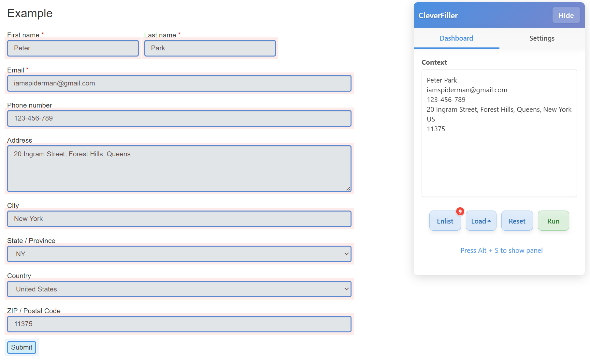

# CleverFiller

English | [中文](docs/README-zh.md)

## Overview

A tampermonkey script that fills form fields, using AI model to find the best match data for the fields. Simply, it just frees you a lot of time from filling out boring forms.

## Features

**Auto-fill**: Automatically fills out form fields based on the context provided.

**Easy to use**: You have the discretion to choose which fields are needed in the form.

**RPA alike functionality**: You will be able to set up preload or afterload actions to create a workflow.

## Basic Usage

> [!IMPORTANT]
> You need a [Deepseek API](https://deepseek.ai/) key to enable implementation of AI model.

1. **Enlist** button allows you to scan the fillable fields in the form.
2. **Load** button allows you to click certain buttons before or after filling the form.
3. In **Context** section, you will need to provide sufficient context for AI model to analyse and match the data.

## Installation

1. Install Tampermonkey extension or [Scriptcat](https://docs.scriptcat.org/) for your browser so as to run this script.
2. Import CleverFiller script to the extension with this url: `https://raw.githubusercontent.com/joolowweng/cleverfiller/main/dist/cleverfiller.user.js`
3. Enable the script in the extension.

## License

This work is licensed under the GNU AGPLv3 License.
